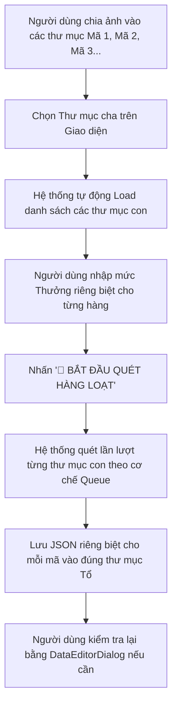

# 📋 KẾ HOẠCH TRIỂN KHAI: HỆ THỐNG QUÉT BATCH OCR THEO THƯ MỤC MÃ HÀNG - TAB 2

Tài liệu này trình bày giải pháp nâng cấp Tab 2 từ chế độ quét đơn lẻ sang **quét hàng loạt tự động (Batch Processing) theo cấu trúc thư mục mã hàng**, cho phép cấu hình thưởng độc lập cho từng mã hàng và hoạt động ổn định trên tài khoản **Gemini AI Free**.

---

## 1. Quy Trình Vận Hành Mới (User Workflow)

1. **Chuẩn bị ảnh**: Bạn chia ảnh sản lượng vào các thư mục con đặt tên theo mã hàng (Ví dụ: thư mục `MH-01` chứa 6 ảnh trang, thư mục `MH-02` chứa 12 ảnh...).
2. **Chọn Folder gốc**: Nhấn nút **📂 Chọn thư mục quét hàng loạt** để chọn thư mục cha chứa các thư mục mã hàng kia.
3. **Cấu hình trực tiếp trên bảng**: Giao diện hiển thị danh sách các mã hàng dưới dạng bảng. Bạn có thể **gõ trực tiếp mức Thưởng mã hàng mới** riêng cho từng mã.
4. **Bắt đầu Batch**: Nhấn nút quét hàng loạt, chương trình sẽ tự động xử lý tuần tự từng mã một.

---

## 2. Kiến Trúc Giao Diện Mới (Tab 2 UI Redesign)

Giao diện Tab 2 sẽ được phân bổ lại cực kỳ chuyên nghiệp và tối ưu diện tích hiển thị:

* **Khung bên trái: Cấu hình đầu vào & Quét thư mục**:
  * Nút **📂 Chọn thư mục quét hàng loạt** (Thay thế nút tải ảnh đơn lẻ).
  * Hiển thị đường dẫn thư mục gốc đang chọn.
  * Khung cấu hình Gemini Key & Model AI (giữ nguyên cấu hình cũ an toàn).

* **Khung chính ở giữa: Bảng danh sách Mã hàng Batch**:
  Một `QTableWidget` hiển thị danh sách các mã hàng được tìm thấy:
  | STT | Thư mục con (Mã hàng) | Số lượng ảnh | Thưởng mã mới (%) | Trạng thái quét | Hành động |
  | :---: | :--- | :---: | :---: | :--- | :---: |
  | 1 | `MH-ABC` | 6 ảnh | `[ 15 ]` | `🟢 Thành công` | [👁️ Xem/Sửa] |
  | 2 | `MH-XYZ` | 12 ảnh | `[ 0 ]` | `🟡 Đang quét (50%)...`| [👁️ Xem/Sửa] |
  | 3 | `MH-DEF` | 9 ảnh | `[ 10 ]` | `🔴 Lỗi API (429)` | [🔄 Thử lại] |

  * *Lưu ý*: Cột **Thưởng mã mới (%)** là một ô nhập số (`QLineEdit` nhỏ) nằm trực tiếp trong mỗi hàng để bạn cấu hình độc lập cho từng mã hàng trước khi bấm quét.

---

## 3. Cơ Chế Chạy Batch Tuần Tự (Sequential Queue Engine)

Vì sử dụng tài khoản **Gemini AI Free** có các giới hạn nghiêm ngặt về Token và số lượt gọi trên phút (RPM - Requests Per Minute), cơ chế chạy batch sẽ được lập trình theo kiểu **Queue tuần tự (Single-threaded Loop)** thay vì đa luồng song song để đảm bảo an toàn tuyệt đối.

### 3.1. Tiến Trình Xử Lý Chi Tiết của Hàng Đợi:
1. Hệ thống khởi tạo một hàng đợi (Queue) chứa thông tin của tất cả các mã hàng được tích chọn quét.
2. Khởi chạy luồng chạy ngầm (`QThread`):
   * Lấy mã hàng thứ nhất: Đọc toàn bộ ảnh bên trong thư mục con đó.
   * Gửi gộp tất cả các ảnh đó kèm prompt lên Gemini AI trong 1 yêu cầu duy nhất.
   * Chờ phản hồi từ AI.
   * Nếu thành công:
     * Trích xuất JSON.
     * Áp dụng mức **Thưởng mã hàng mới** riêng biệt của hàng đó vào JSON.
     * Tự động lưu vào đường dẫn chuẩn: `D:/Linh_Salary_Tool/02_ma_hang/{Year}/{Month}/{Tổ X}/{Mã hàng}.json`.
     * Cập nhật trạng thái dòng đó thành `🟢 Thành công`.
   * Nếu thất bại:
     * Cập nhật trạng thái dòng đó thành `🔴 Lỗi: {Chi tiết lỗi}`.
     * Ghi lỗi rõ ràng ra nhật ký xử lý (Log Area).
     * **Quan trọng**: Bỏ qua mã lỗi và tiếp tục xử lý mã hàng tiếp theo trong hàng đợi, không làm gián đoạn toàn bộ tiến trình.
3. **Cơ chế chống nghẽn (Rate Limit Avoidance)**:
   * Thêm một khoảng **trễ cố định (Delay) từ 2 - 3 giây** giữa các mã hàng sau khi hoàn tất để đảm bảo không bị Gemini Free báo lỗi `429 Too Many Requests`.

---

## 4. Các Trạng Thái và Thao Tác Chỉnh Sửa Sau Quét (Post-Scan Review)

Sau khi toàn bộ hàng đợi chạy xong:
* **Xem / Sửa trực tiếp**: Bạn chỉ cần click nút **[👁️ Xem/Sửa]** tương ứng của hàng đó. Hệ thống sẽ mở file JSON vừa được lưu lên thông qua hộp thoại `DataEditorDialog` hiện tại để bạn kiểm tra, chỉnh sửa nhân sự, sản lượng và lưu lại trực tiếp cực kỳ tiện lợi.
* **Chạy lại riêng lẻ (Retry Single)**: Nếu một mã hàng nào đó bị lỗi do mạng hoặc API bị nghẽn, bạn có thể bấm nút **[🔄 Thử lại]** riêng cho hàng đó mà không cần quét lại các mã hàng đã thành công.

---

## 5. Kế Hoạch Các Bước Thực Hiện (Implementation Plan)

### Bước 1: Cập nhật UI (`scan_widget.py`)
* Tạo bảng danh sách Batch (`QTableWidget`) chiếm diện tích lớn ở trung tâm.
* Bổ sung nút **Chọn thư mục** để duyệt thư mục cha và tự động quét các thư mục con để nạp vào bảng.
* Thiết lập các ô nhập mức thưởng riêng cho mỗi mã hàng trong cột bảng.

### Bước 2: Nâng cấp luồng chạy ngầm (`scan_thread.py`)
* Thiết kế lại luồng xử lý nhận đầu vào là danh sách các thư mục con kèm theo mức thưởng tương ứng.
* Triển khai vòng lặp tuần tự chạy qua từng mã hàng, tích hợp khoảng trễ (Delay) phòng chống giới hạn API.
* Ghi log riêng biệt và xử lý lỗi cô lập (luôn chạy tiếp khi gặp lỗi).
