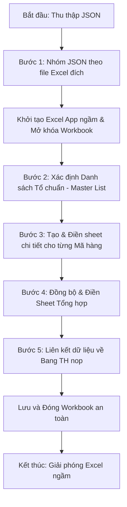

# Tài liệu Phân tích Logic Nghiệp vụ - Tab 3: Link Dữ liệu (Tích hợp Excel)

Tài liệu này phân tích chi tiết luồng xử lý code, cấu trúc dữ liệu và logic nghiệp vụ của **Tab 3 (Tích hợp Dữ liệu)** trong ứng dụng **Scan2Excel AI**. Tab 3 đóng vai trò quan trọng trong việc đưa kết quả số hóa (các file JSON sau khi quét OCR) tích hợp trực tiếp vào các file Excel quản lý lương sản phẩm của từng tổ/bộ phận.

---

## 📌 1. Tổng quan Nghiệp vụ Tab 3
Mục tiêu chính của Tab 3 là tự động hóa quá trình nhập liệu thủ công cực kỳ phức tạp từ các báo cáo sản lượng hằng ngày vào các file Excel mẫu của nhà máy. 

Hệ thống sẽ đọc các file JSON chứa thông tin sản lượng công đoạn của từng công nhân và thực hiện:
* **Tự động nhận diện tổ và tháng/năm** để tìm file Excel đích tương ứng (hỗ trợ chạy 1 tổ hoặc chạy hàng loạt).
* **Đồng bộ danh sách nhân viên**: Phân biệt nhân viên chính thức của tổ và nhân viên tăng cường từ tổ khác (nhân viên ngoài tổ).
* **Tạo và đổ dữ liệu chi tiết từng Mã Hàng** dựa trên sheet mẫu `xxx`, tự động tính toán bằng công thức Excel.
* **Cập nhật Bảng Tổng hợp ("Tong hop cac ma")** để theo dõi thưởng mã hàng mới và tổng sản lượng quy đổi.
* **Liên kết dữ liệu về Bảng Thu nhập ("Bang TH nop")** bằng công thức động và **tự động điền sản lượng/giây làm ngoài tổ** của nhân viên vào các cột tương ứng.

---

## 🛠️ 2. Quy trình Xử lý Chi tiết (5 Bước cốt lõi)

Hàm xử lý trung tâm là `process_excel_integration` trong `logic/excel_integration.py` hoạt động theo một quy trình 5 bước nghiêm ngặt:

### 🔹 Bước 1: Thu thập và Nhóm dữ liệu
* Hệ thống quét thư mục JSON đầu vào (thư mục của Tháng/Năm) để tìm **tất cả** các file `.json`.
* Đọc thông tin chung của từng file JSON để lấy **Tổ sản xuất** và **Thời gian**, đồng thời **tính toán trước tổng sản lượng (Giây) của mọi nhân viên** ở mọi tổ.
* Nếu người dùng chọn **chạy 1 tổ**, hệ thống sẽ chỉ lọc ra các file JSON thuộc tổ đó để xử lý tiếp (nhưng vẫn giữ kết quả tính toán Giây ngoài tổ từ bước trên).
* Ghép nối để xác định tên file Excel đích tương ứng: `Tên_Tổ - MM.xlsx` (Ví dụ: `Tổ 1 - 05.xlsx`).
* Gom nhóm danh sách các file JSON thuộc cùng một file Excel đích để xử lý gộp trong 1 lần mở file.

---

### 🔹 Bước 2: Xác định Danh sách Tổ chuẩn (Master List)
Để đảm bảo tính chính xác và không làm xáo trộn thứ tự dòng của các nhân viên có sẵn trong tổ, hệ thống xây dựng danh sách nhân viên theo cơ chế ưu tiên:

1. **Đọc danh sách Nhân viên trong tổ (Danh sách gốc)**:
   * Ưu tiên 1: Đọc từ sheet **"Danh sách"** (có sẵn do quá trình tách file sinh ra).
   * Ưu tiên 2: Đọc trực tiếp từ sheet **"Bang TH nop"** (từ dòng 9 trở đi, bước nhảy 2 dòng).
   * *Mục đích*: Giữ nguyên thứ tự hiển thị của các nhân viên chính thức trong tổ.
2. **Thu thập danh sách Nhân viên ngoài tổ (Nhân viên tăng cường)**:
   * Quét tất cả các mã nhân viên xuất hiện trong dữ liệu thực hiện của các file JSON.
   * Lọc ra các mã nhân viên **chưa có mặt** trong danh sách tổ gốc.
   * *Nguyên tắc*: Đối với nhân viên ngoài tổ, hệ thống **chỉ hiển thị Mã số NV và để trống Họ và Tên** (Tên sẽ được điền thủ công hoặc đối chiếu sau).
3. **Hợp nhất (Master List)**:
   * `Master List = Nhân viên trong tổ + Nhân viên ngoài tổ (đã sắp xếp tăng dần theo Mã số)`.
   * Tạo bảng tra cứu dòng `master_row_lookup` để ánh xạ nhanh mỗi Mã số NV ứng với dòng Excel nào (bắt đầu từ dòng 9, mỗi người cách nhau 2 dòng: dòng 9, dòng 11, dòng 13,...).

---

### 🔹 Bước 3: Xử lý Chi tiết từng Mã Hàng
Với mỗi mã hàng (mỗi file JSON), hệ thống sẽ tạo ra một sheet dữ liệu sản lượng riêng:

1. **Khởi tạo Sheet mới từ Mẫu (`xxx`)**:
   * Kiểm tra và xóa sheet mã hàng cũ nếu đã tồn tại để tránh xung đột ghi đè.
   * Tạo một sheet mới đứng đầu bảng tính, copy toàn bộ định dạng và công thức từ sheet mẫu có tên là `xxx`.
   * Đổi tên sheet mới thành tên Mã Hàng (được làm sạch ký tự đặc biệt và giới hạn dưới 31 ký tự).
2. **Điền thông tin chung**:
   * Ô `B1`: Mã hàng.
   * Ô `B2`: Tổng sản lượng mục tiêu.
   * Ô `C1`: Tiêu đề bảng lương tháng/năm.
3. **Ánh xạ công đoạn**:
   * Duyệt danh sách công đoạn trong JSON. Với mỗi công đoạn `stt`, xác định cột Excel tương ứng (`Cột = 5 + stt`).
   * Điền đơn giá công đoạn (Định mức T) vào dòng 6 của cột đó.
4. **Điền danh sách nhân viên và sản lượng thực hiện**:
   * Ghi danh sách nhân viên liên quan đến mã hàng này (gồm toàn bộ tổ gốc và các nhân viên ngoài tổ có tham gia làm mã hàng này).
   * Điền công thức tính tiền lương sản phẩm bằng Excel Formula tại Cột D (Thành tiền):
     `=SUMPRODUCT(F{row}:HE{row}, $F$6:$HE$6)/100` (Nhân sản lượng thực tế với đơn giá công đoạn).
   * Cộng dồn sản lượng làm được của từng công nhân vào giao điểm của Dòng (Nhân viên) và Cột (Công đoạn).

---

### 🔹 Bước 4: Cập nhật Sheet Tổng hợp ("Tong hop cac ma")
Sheet `Tong hop cac ma` đóng vai trò trung gian gom tiền lương của các mã hàng để tính toán hệ số thưởng:

1. **Làm sạch dữ liệu cũ**: Xóa trắng vùng dữ liệu từ `A9:Q1000` (giữ lại các cột tính toán tổng hợp bên phải từ cột R trở đi).
2. **Điền thông tin Master List**: Điền toàn bộ danh sách nhân viên (gồm cả trong tổ và ngoài tổ) từ dòng 9 (cách 1 dòng trống).
3. **Điền thông số mã hàng (Cột D -> Q)**:
   * Mỗi mã hàng tương ứng với một cột (tối đa 14 mã hàng).
   * Hàng 3: Điền **Thưởng mã hàng mới** (ví dụ: `5%` dạng `0.05`).
   * Hàng 4: Tên Mã hàng.
   * Hàng 5: Tổng sản lượng mục tiêu.
   * Hàng 7: Ký hiệu mã hàng (`M1`, `M2`, `M3`,...).
4. **Thiết lập công thức liên kết động**:
   * Với mỗi nhân viên, nếu có tham gia làm mã hàng đó, hệ thống sẽ điền công thức Excel liên kết trực tiếp sang sheet chi tiết của mã hàng đó:
     `='Tên_Mã_Hàng'!D{dòng_ở_sheet_chi_tiết}` (Link cột Thành tiền).
   * Nếu nhân viên không làm mã hàng đó, gán giá trị = `0`.
   * Cột R (Tổng tiền đã nhân hệ số thưởng mã hàng mới): `=+SUMPRODUCT(D{row}:Q{row}, $D$3:$Q$3)`
   * Cột S (Tổng thu nhập sản phẩm thực tế): `=SUM(D{row}:R{row})` (Tổng tiền thô + Tiền thưởng mã hàng mới).

---

### 🔹 Bước 5: Đồng bộ Sheet "Bang TH nop"

1. **Đồng bộ về "Bang TH nop" (Bảng Thu nhập nộp văn phòng)**:
   * Nhận diện động các cột tương ứng với các tổ khác trong nhà máy từ dòng 4 (cột F đến cột W).
   * Xóa sạch dữ liệu cũ ở cột A-W từ dòng 9 trở đi.
   * Duyệt qua Master List. Để đảm bảo giữ nguyên định dạng viền (Border) và định dạng cell (Merged Cells dòng phụ), hệ thống sử dụng kỹ thuật: **Copy dòng 9-10 mẫu và chèn thêm (`Insert`) tương ứng với số lượng nhân viên**.
   * Ghi thông tin STT, Họ và tên, Mã số NV vào các cột A, B, C.
   * Link công thức cột E (Tổng lương sản phẩm thực tế của tổ) trực tiếp từ sheet tổng hợp sang:
     `='Tong hop cac ma'!S{dòng_ở_sheet_tong_hop}`
   * **Điền dữ liệu Ngoài tổ**: Đối chiếu với dữ liệu Giây đã tính toán ở Bước 1, nếu nhân viên có làm việc ở tổ khác, hệ thống sẽ điền số Giây đó vào đúng cột tương ứng của tổ đó (từ cột F trở đi).
   * *Ưu điểm*: Toàn bộ công thức tính toán nâng cao của các cột bên phải (nếu có) được bảo toàn nguyên vẹn và kết quả làm ngoài tổ được hiển thị tự động.

---

## 💎 3. Các Điểm Thiết kế Kỹ thuật Thông minh

* **Khử Trùng Lặp Thông Minh**:
  Trong quá trình xây dựng danh sách chuẩn từ sheet gốc và dữ liệu JSON, hệ thống sử dụng cấu trúc `set()` để khử hoàn toàn hiện tượng trùng lặp mã nhân viên, giúp dữ liệu ghi xuống luôn đảm bảo tính nhất quán (1 nhân viên chỉ xuất hiện trên duy nhất 1 dòng).

* **Tối Ưu Hóa Tốc Độ Bằng Cách Tắt Tính Năng Vẽ Giao Diện (ScreenUpdating)**:
  Do win32com tương tác trực tiếp với ứng dụng Excel của hệ điều hành, việc liên tục tạo sheet, copy định dạng và chèn hàng sẽ rất chậm và gây nhấp nháy màn hình. Code đã tắt `ScreenUpdating = False` và `DisplayAlerts = False` giúp tăng tốc độ xử lý lên **gấp 10 lần** và loại bỏ các hộp thoại cảnh báo phiền phức của Excel.

* **Đảm Bảo An Toàn Bộ Nhớ & Tránh Treo Tiến Trình Excel**:
  * Trước khi chạy tích hợp, code chủ động chạy lệnh `taskkill` để dọn dẹp các tiến trình Excel bị treo trước đó.
  * Toàn bộ quá trình mở workbook được bọc trong khối lệnh `try...except...finally` cực kỳ an toàn. 
  * Trong khối lệnh `finally`, Excel luôn luôn được đóng (`wb.Close()`), ứng dụng Excel luôn được thoát (`excel_app.Quit()`), đồng thời giải phóng bộ nhớ bằng bộ dọn rác của Python (`gc.collect()`), ngăn chặn triệt để lỗi khóa file (Read-only) trong tương lai.

---

## 📈 4. Kết luận
Logic xử lý của Tab 3 là sự kết hợp chặt chẽ giữa sức mạnh tính toán của **Python** (để xử lý cấu trúc dữ liệu JSON phức tạp, lọc trùng, chuẩn hóa danh sách) và khả năng lưu trữ, trình diễn của **Excel** (giữ lại công thức nguyên bản, tạo sheet động từ template có sẵn). Thiết kế này giúp người dùng tiết kiệm hàng giờ nhập liệu thủ công mỗi ngày mà vẫn có những file báo cáo lương đúng quy chuẩn của nhà máy.

---

## ✨ 5. Các Tính Năng Mới Cập Nhật (Bổ sung theo yêu cầu)

Để đáp ứng linh hoạt các kịch bản thực tế của xưởng sản xuất, quy trình tích hợp ở Tab 3 đã được nâng cấp bổ sung các tính năng sau:

### 1. Hỗ trợ nhiều chế độ chạy linh hoạt
- **Chạy cho 1 tổ (Chỉ định Folder)**: Người dùng có thể chỉ định chính xác 1 thư mục chứa dữ liệu JSON của tổ cụ thể (VD: Thư mục Tổ 1). Hệ thống sẽ tự động đọc cấu trúc JSON để phân tích cấu hình **Tháng/Năm** và **Tên tổ**, từ đó trích xuất thông tin mà không cần nhập liệu thủ công.
- **Chạy hàng loạt cho tất cả các tổ**: Người dùng chỉ cần nhập Tháng/Năm hiện tại, hệ thống sẽ tự động quét thư mục tổng của tháng đó, gom nhóm dữ liệu của tất cả các tổ và xử lý lần lượt toàn bộ nhà máy.

### 2. Tự động tính toán Lương ngoài tổ (Tăng cường)
- Trong sheet **"Bang TH nop"**, bên cạnh cột "Giây" của tổ chính, từ cột **F4 đến W4** tương ứng với các tổ khác trong nhà máy (Tổ 1 -> Tổ 12, Tổ trưởng may, Thời vụ, Là TP, Kiểm hoá, Hậu giặt, Cắt, Hoàn thiện, Cơ động).
- Hệ thống sẽ **quét chéo** dữ liệu JSON của toàn bộ các tổ khác trong cùng một tháng để tìm kiếm dấu vết làm việc của nhân viên.
- **Ví dụ**: Nếu nhân viên A thuộc Tổ 1, nhưng hệ thống phát hiện có ghi nhận sản lượng của nhân viên A trong các file JSON thuộc Tổ 3, hệ thống sẽ tự động tính toán tổng số tiền lương (tổng Giây) mà nhân viên A kiếm được tại Tổ 3, và điền kết quả vào cột **H4 (Tổ 3)** ngay trên dòng của nhân viên A trong file báo cáo của Tổ 1. Tương tự cho các tổ khác.
- Việc này giúp theo dõi và thanh toán đầy đủ, chính xác tổng thu nhập của một công nhân kể cả khi họ phải đi điều động ở các bộ phận khác.
